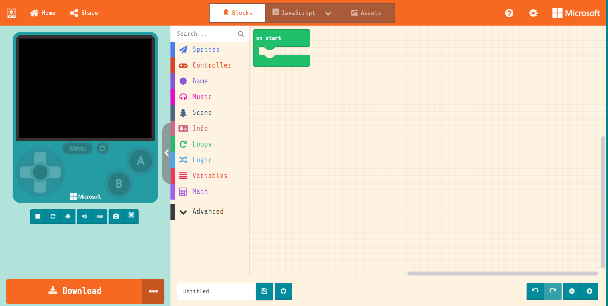
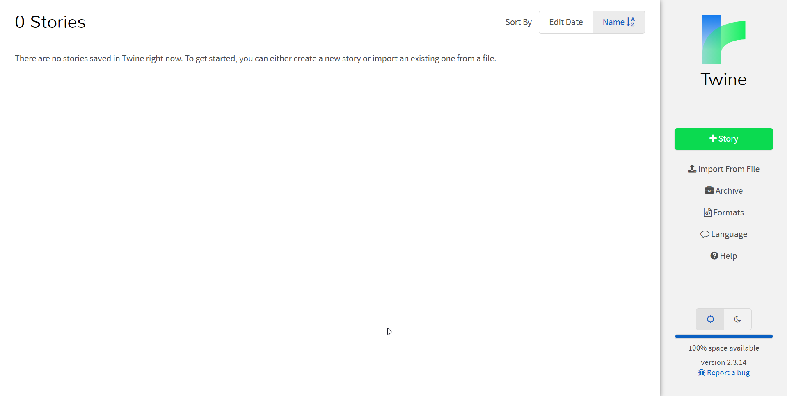
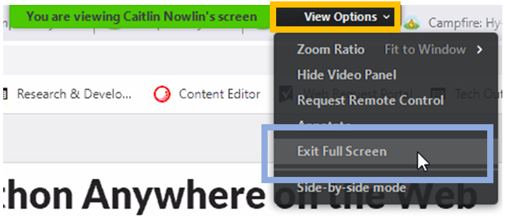
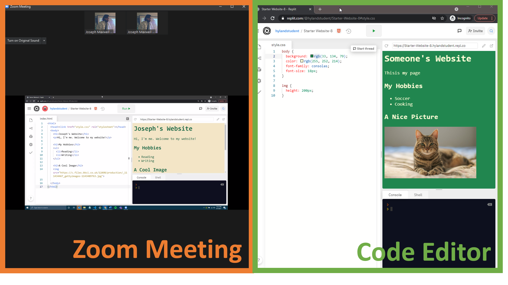

# Pre-Camp Instructions
Please read through these instructions before the night of the camp.

## Recommendations
- We recommend a desktop or laptop computer for all virtual camps.
- If you have multiple devices available, it will be beneficial to join the Zoom meeting from one device, and code using a separate device. For example, if you have two laptops, you could join the Zoom meeting from one of the laptops, and do the activities on the other laptop.
- A Chromebook could be used, but it may not give you the best experience. An ideal situation for a Chromebook user would be to also have access to a laptop or desktop to use as a second device. That said, if you do not have any other devices, we hope you still try to participate as best you can! 
- We do not recommend using a phone or tablet as your main device for the virtual Hy-Tech Camp. This is because the size of those screens may make it difficult to participate in the activities.

## Before the Meeting
1. Download Zoom onto your device if you do not already have it installed.
1. Make sure you can properly open the tool for your camp on your device. Check below to see which tools are needed.

### Creating Video Games with MakeCode Arcade
For the Creating Video Games camp, you should be able to open [MakeCode Arcade](https://arcade.makecode.com/#editor). It should look something like this:

### Interactive Storytelling with Twine
For the Interactive Storytelling camp, you should be able to open [Twine](http://twinery.org/2/#!/stories). Click the "Skip" button, and it should look something like this:

### Programming with Python AND Building Webpages
For both the Programming with Python camp AND the Building Webpages camp, you should be able to open [Replit](https://replit.com). It should look something like this:

## During the Meeting - Presentation & Kahoot
1. During the lecture portion, the instructor will share their screen through Zoom. Keep the window maximized to participate.
1. If there is a Kahoot quiz, the questions will appear in the Zoom meeting, but you will have to answer the questions elsewhere.
   - If you have a phone or another device, we recommend using that device to answer the questions. Instructions will appear on the screen in the Zoom meeting.
   - If you only have one device, you can open a new web browser window and follow the instructions to join the Kahoot from there. We can help you get everything set up.

# During the Meeting – Code-Along: Single Device
The most difficult setup will be for the code-along. The ultimate goal is for you to see both the instructor's code and your own code at the same time.

1. In the Zoom meeting, move your cursor to the top of the screen and hold it there. A menu bar should appear. From there, click on "View Options" and then "Exit Full Screen":
    
1. Move the Zoom meeting to the left side of your screen, and adjust the size of the window so it only takes up the left half of the screen.
1. Open up the code editor in a web browser.
1. Move the web browser window to the right side of the screen, so both the Zoom meeting and the web browser window (code editor) are visible:
    
1. Adjust as needed. You should be able to see the code from the instructor's screen AND your own code.

If desired, it is also possible to switch between the Zoom window and the web browser window throughout the code-along.

## During the Meeting – Code-Along: Multiple Devices
If you have multiple devices, use one device to view the Zoom meeting, and another device to code.
